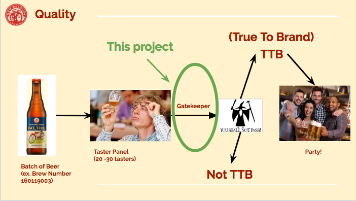
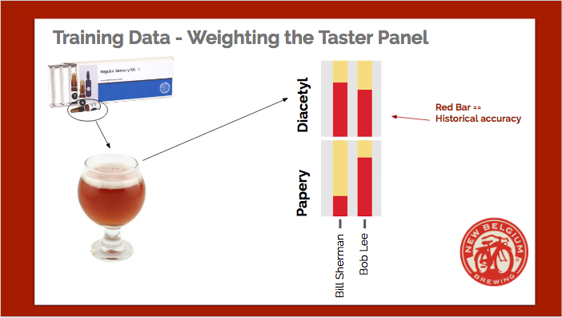
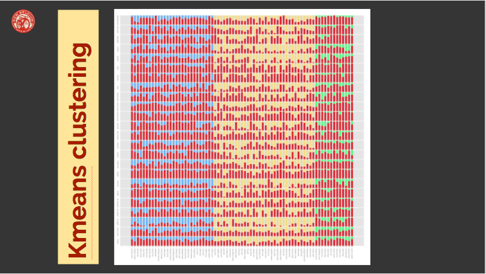
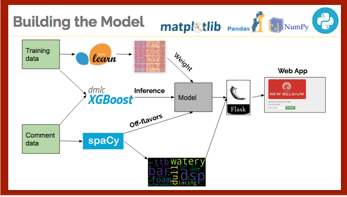
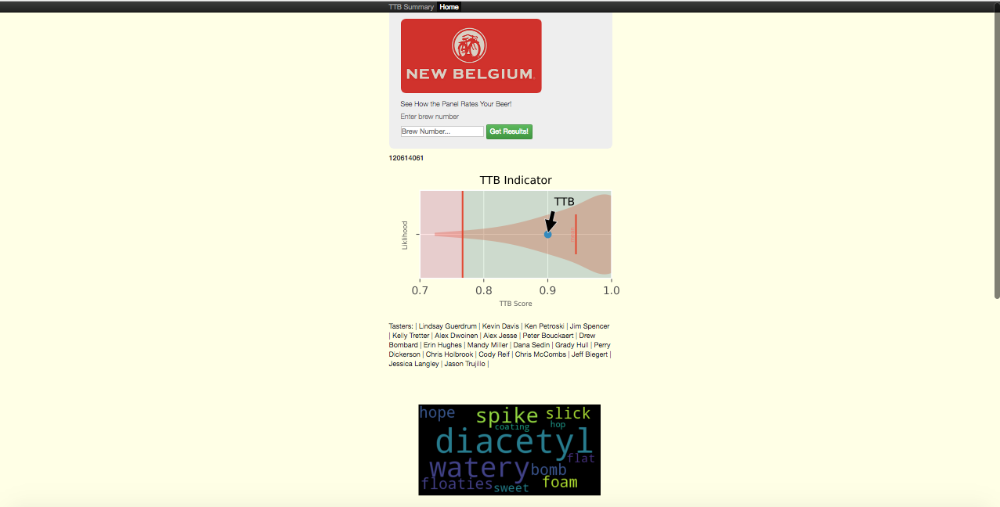
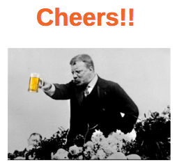

# Scoring Beers For New Belgium
### Predicting a beer's score using XGBoost,NLP, and K-means and building a web app for daily use.

Slides available at:  [slides](https://docs.google.com/presentation/d/1J8WPJ5li_JKKvwMSkTPeRAsvcDAzBeEdkMxWl9er1vY/edit#slide=id.gcb9a0b074_1_0)

> To determine if a batch of beer meets New Belgium's quality standards, the beer is rated by 20 - 30 expert tasters and from this data, the gatekeeper makes the final call- True To Brand or Not TTB.  

> Currently, the gatekeeper has to dicipher up to 6 free text comment fields per taster.  236,000 rows of this comment data _(not available)_ were used building the model.

\
\
\
\

> The other data set for this project were accuracy records for each taster during training.

> In training, a known "off-flavor" is spiked into the beer. The chart shows how historically accurate each taster is at identifying each "off-flavor."  A red column would be "perfect for that off-flavor"

\
\
\
\

> With the help of K-means clustering, we are able to group the tasters into categories good _(yellow)_, better _(blue)_, best _(green)_ and weight each taster accordingly in the model.

\
\
\
\

> spaCy was used to perform Natural Language Processing on the comment data to pull out the "off-flavors"

> By joining the two data tables together, an XGBoost model was built that infers the likelihood for each off-flavor

\
\
\
\

***
Screen shots from live web app used on New Belgium's intranet

New Belgium brewery wants some help turning the comments data they collect during their beer tastings into statistically analyzable data.  They want to turn comments like "cheesy" into a tag like Isovaleric2 (where the 2 describes the intensity of the flavor).

This project is due in-part to the success of Jan Van Zeghbroeck's project:
https://github.com/janvanzeghbroeck/Seeing-Taste

word clouds generated with the help of:
https://github.com/amueller/word_cloud
